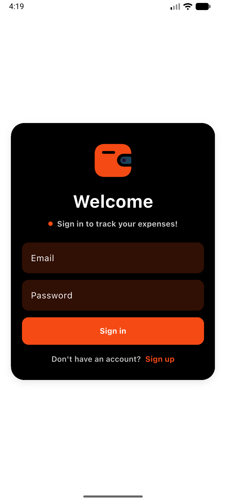
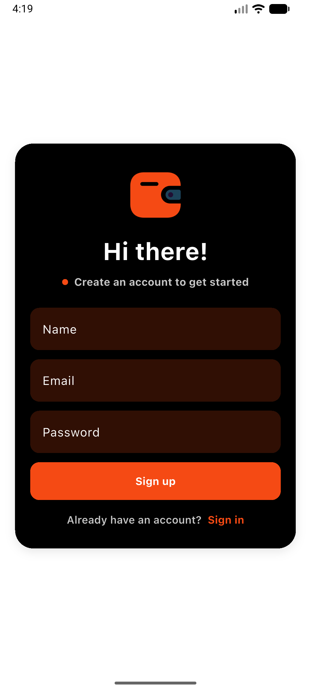

# EXPENDI

Expendi is a expense tracker application for managing personal budgets, expenses, categories, payment methods, and
user profiles. Built with Flutter and modern Material-3 Widgets.

## Features
- **User Authentication**: Register, login, and token-based authentication (JWT).
- **Budget Management**: Create, update, and track budgets.
- **Expense Tracking**: Add, update, delete, and list expenses.
- **Category Management**: Organize expenses by categories.
- **Payment Methods**: Manage different payment methods.
- **User Profiles**: View and update user profile information.
- **API Documentation**: Swagger/OpenAPI documentation included.
- **Error Handling**: Centralized error handling middleware.

## Screenshots

